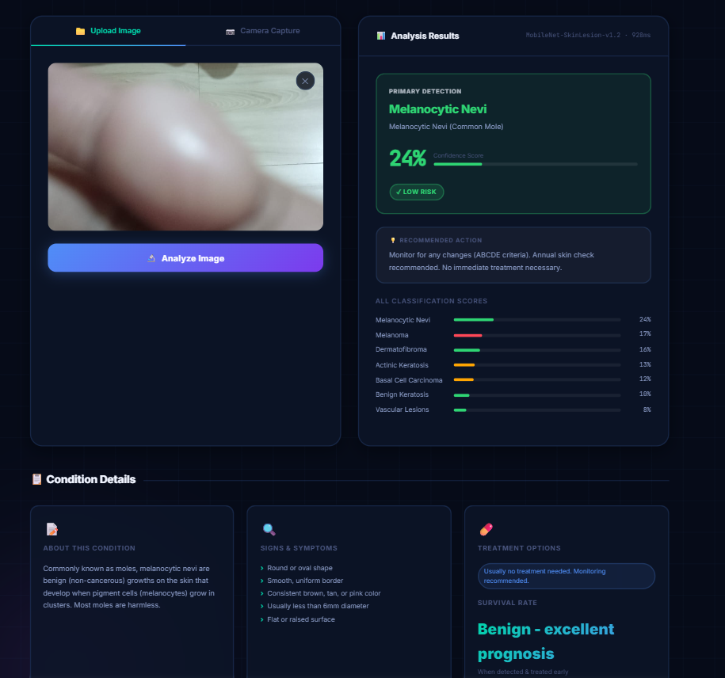
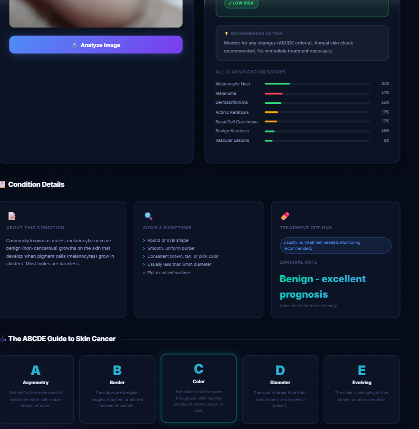

# 🔬 DermAI — AI Skin Cancer Detection System

[](https://developer.mozilla.org/en-US/docs/Web/HTML)
[](https://developer.mozilla.org/en-US/docs/Web/CSS)
[](https://developer.mozilla.org/en-US/docs/Web/JavaScript)
[](https://www.tensorflow.org/js)
[](LICENSE)

> **⚠️ Disclaimer:** This tool is for **educational purposes only** and is **not a substitute for professional medical advice**. Always consult a qualified dermatologist or healthcare provider for diagnosis and treatment.

---

## 📋 Overview

**DermAI** is a browser-based AI-powered skin cancer detection application. It uses a deep learning model (powered by **TensorFlow.js**) trained on the [HAM10000 dataset](https://www.kaggle.com/datasets/kmader/skin-lesion-analysis-toward-melanoma-detection) to classify skin lesion images into **7 different categories** with confidence scores and clinical guidance — all running entirely in your browser with **no server or data upload required**.

---

## 📸 Screenshots

### 🏠 Home Page


### 📊 Analysis Results — Full View


### 🔬 Condition Details & ABCDE Guide


---

## ✨ Features

- 🖼️ **Image Upload** — Drag & drop or browse to upload a skin lesion image
- 📷 **Live Camera Capture** — Use your device camera to capture and analyze in real time
- 🤖 **AI Classification** — Instant prediction across 7 skin condition types
- 📊 **Confidence Scores** — Visual probability bars for each classification
- ⚕️ **Clinical Guidance** — Risk level, symptoms, treatment options & urgency level
- 🔬 **ABCDE Criteria** — Educational guide to spot warning signs
- 🔒 **100% Private** — All processing happens locally in the browser; no data is sent to any server
- 📱 **Responsive Design** — Works on desktop and mobile devices

---

## 🦠 Detectable Skin Conditions

| Abbreviation | Condition | Risk Level |
|---|---|---|
| `mel` | Melanoma | 🔴 HIGH |
| `bcc` | Basal Cell Carcinoma | 🟠 MEDIUM |
| `akiec` | Actinic Keratosis / Intraepithelial Carcinoma | 🟠 MEDIUM |
| `nv` | Melanocytic Nevi (Common Mole) | 🟢 LOW |
| `bkl` | Benign Keratosis-like Lesions | 🟢 LOW |
| `df` | Dermatofibroma | 🟢 LOW |
| `vasc` | Vascular Lesions | 🟢 LOW |

---

## 🛠️ Tech Stack

| Technology | Purpose |
|---|---|
| **HTML5** | App structure & semantic markup |
| **CSS3** | Styling, animations, glassmorphism UI |
| **JavaScript (ES6+)** | Application logic, DOM manipulation |
| **TensorFlow.js v4.14** | In-browser deep learning inference |
| **HAM10000 Dataset** | Model training data (7 skin lesion classes) |

---

## 🚀 Getting Started

No installation or build step required! Just open the app in a browser.

### Option 1 — Open Directly
```
Double-click index.html to open in your browser
```

### Option 2 — Serve Locally (recommended for camera access)
```bash
# Using Python
python -m http.server 8080

# Using Node.js
npx serve .
```
Then open `http://localhost:8080` in your browser.

> **Note:** Camera access requires the page to be served over `http://localhost` or `https://`. Opening the file directly (`file://`) may restrict camera permissions.

---

## 📁 Project Structure

```
skin-cancer-detection/
├── index.html        # Main app UI & layout
├── styles.css        # All styling, animations & responsive design
├── app.js            # Core application logic & UI interactions
├── model.js          # TensorFlow.js model loading & inference
├── data.js           # Skin condition data, descriptions & ABCDE criteria
├── ist page.png      # Screenshot — Home page
├── 2nd.png           # Screenshot — Analysis results
├── 3rd.png           # Screenshot — Condition details & ABCDE guide
└── README.md         # This file
```

---

## 🧠 How It Works

1. **Model Loading** — A pre-trained CNN model is loaded via TensorFlow.js on app startup
2. **Image Preprocessing** — The input image is resized and normalized to match the model's expected input format
3. **Inference** — The model runs predictions and outputs probability scores for all 7 classes
4. **Results Display** — The top prediction is shown with confidence, risk level, symptoms, treatment info, and recommended actions

---

## ⚕️ ABCDE Rule

DermAI also educates users on the **ABCDE criteria** for identifying potentially cancerous skin lesions:

| Letter | Meaning |
|---|---|
| **A** | **Asymmetry** — One half doesn't match the other |
| **B** | **Border** — Irregular, ragged, or blurred edges |
| **C** | **Color** — Uneven coloring (multiple shades) |
| **D** | **Diameter** — Larger than 6mm (pencil eraser) |
| **E** | **Evolving** — Changing in size, shape, or color |

---

## ⚠️ Medical Disclaimer

This application is built for **educational and research purposes only**.

- It is **NOT** a certified medical device
- Results should **NOT** be used to self-diagnose or replace professional medical advice
- Always consult a **licensed dermatologist or physician** for any skin concerns
- Early detection saves lives — please see a doctor if you have any concerns

---

## 🙌 Acknowledgements

- [HAM10000 Dataset](https://www.kaggle.com/datasets/kmader/skin-lesion-analysis-toward-melanoma-detection) — Human Against Machine with 10000 training images
- [TensorFlow.js](https://www.tensorflow.org/js) — Machine learning in the browser
- Tschandl, P., Rosendahl, C. & Kittler, H. — Original HAM10000 dataset authors

---

## 📄 License

This project is licensed under the **MIT License** — see the [LICENSE](LICENSE) file for details.

---

<p align="center">Made with ❤️ for early skin cancer awareness</p>
